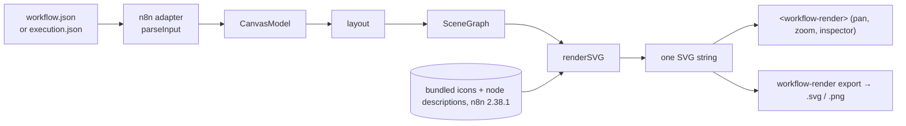

# workflow-render

> An offline renderer for workflow and execution JSON: a web component, a viewer page and a CLI that export SVG and PNG. n8n is the first supported platform.

[](https://github.com/LudwigGerdes/workflow-render/actions/workflows/ci.yml)
[](LICENSE)
[](#compatibility)


<details><summary>Text transcript of the image and the command that produced it</summary>

```
$ node packages/cli/dist/cli.js export packages/core/test/fixtures/order-intake.json -o my-workflow.png --scale 3
wrote my-workflow.png
```

Five tiles on a dotted canvas, left to right: **Webhook** (rounded-left trigger
tile, webhook glyph) → **Is large order?** (IF glyph, two outputs labelled
`true` and `false`) → **Notify Slack** (the Slack logo, subtitle `create:
message`) on the `true` branch and **Tag standard** (pencil glyph, subtitle
`manual`) on the `false` branch → both into **Merge** (subtitle `append`,
two inputs). The subtitles were not typed into the workflow: they come from
the same node descriptions n8n reads.
</details>

## Why

n8n workflows live as JSON, but the only way to *look* at one is to import it
into a running n8n instance. That means a pull request, a runbook, a status
page or a chat message can only carry a screenshot that goes stale the moment
someone edits the workflow. workflow-render renders the JSON itself — workflow or
execution — into the same picture n8n's canvas draws, with no instance, no
login and no network, as a file you can commit or a component you can embed.

## Quickstart

From npm (Node ≥ 20) — one package, `workflow-render`,
with the CLI, the n8n icon and description data, the fonts and the browser
element all inside it:

```bash
# two sample files, or use a workflow / execution JSON of your own
curl -LO https://raw.githubusercontent.com/LudwigGerdes/workflow-render/main/packages/core/test/fixtures/order-intake.json
curl -LO https://raw.githubusercontent.com/LudwigGerdes/workflow-render/main/packages/core/test/fixtures/execution-loop.json

npx workflow-render export order-intake.json -o my-workflow.png --scale 3
npx workflow-render view   execution-loop.json --port 4777
```

or `npm install workflow-render` and call `node_modules/.bin/workflow-render`.
PNG export uses the native [`@resvg/resvg-js`](https://github.com/thx/resvg-js)
addon, which npm installs as a prebuilt binary for your platform.

From a checkout (Node ≥ 20, pnpm 10):

```bash
git clone https://github.com/LudwigGerdes/workflow-render.git && cd workflow-render
pnpm install && pnpm build
node packages/cli/dist/cli.js export packages/core/test/fixtures/order-intake.json -o my-workflow.png --scale 3
node packages/cli/dist/cli.js view   packages/core/test/fixtures/execution-loop.json --port 4777
```

```
wrote my-workflow.png
workflow-render viewing packages/core/test/fixtures/execution-loop.json
  http://127.0.0.1:4777/
Press Ctrl+C to stop.
```

Both routes are exercised end to end by `pnpm smoke` (a fresh clone, and the
packed tarball installed into an empty project), locally and in CI.

Works fully offline — nothing is sent anywhere. The only thing the viewer ever
fetches is the JSON file you point it at, and `view` binds to `127.0.0.1`.

**Getting the JSON out of n8n.** In the editor, open the `…` menu top right
and choose **Download**; or call `GET /api/v1/workflows/:id` with your API key.
For a run, save the response of `GET /rest/executions/:id` (or the public
`GET /api/v1/executions/:id?includeData=true`) — its index-encoded (“flatted”)
`data` is revived automatically.

## What it does

- **As an n8n builder, I want** a picture of a workflow in the pull request
  that changed it **so that** reviewers see the graph, not a JSON diff →
  `workflow-render export` in CI, one PNG per workflow file
- **As an on-call engineer, I want** to open a saved execution and see which
  node failed and what it received **so that** I can read the incident without
  logging into the instance → execution view, click a node for the three-pane
  inspector
- **As a team lead, I want** workflow diagrams in our internal docs that never
  go stale **so that** the wiki matches the repo → `<workflow-render src="…">` on any
  static page, pointed at the committed JSON
- **As someone using AI to build workflows, I want** to look at what the model
  produced before importing it **so that** I catch a missing branch by eye →
  `workflow-render view generated.json`
- **As an n8n builder, I want** to share a workflow with someone who has no n8n
  account **so that** they can read it and click through node parameters → the
  static viewer page, or a self-contained SVG
- **As a maintainer of a workflow library, I want** thumbnails for every
  workflow **so that** the catalogue is browsable → `static` mode, `--scale 1`
- **As a security-minded operator, I want** none of this to touch my instance
  or the network **so that** rendering credentials-bearing JSON stays local →
  everything runs on your machine, from committed data

## How it works



workflow-render reads the JSON, detects whether it is a workflow (`nodes` +
`connections`) or an execution (`workflowData` + `runData`), lays it out from
the positions n8n stored, and renders one deterministic SVG. The viewer and the
exporter share that path, so an export is exactly what you were looking at.
Icons and node descriptions come from data extracted from n8n's published
packages at build time and committed here. It never contacts the network,
never runs the workflow, never talks to an n8n instance and never modifies
your files.

## Compatibility

| | |
|---|---|
| n8n version tested | 2.38.1 — the release whose node descriptions and icons are bundled (`packages/assets/data/2.38.1/`, 564 node types) |
| Other n8n versions | best effort: workflows render, node types unknown to the bundle get an initials tile and a blank subtitle |
| Node | ≥ 20 (CI runs 20 and 22) |
| pnpm | 10.22.0 (`packageManager` in `package.json`) |
| Browsers (element) | evergreen; ES2022 modules, custom elements, shadow DOM |

Every exported SVG stamps `data-descriptions-version="2.38.1"` so you can tell
which bundle rendered it.

## Usage

```
$ node packages/cli/dist/cli.js --help
workflow-render — offline canvas for workflow JSON (n8n supported)

  workflow-render export <file.json> -o <out.svg|out.png> [--scale N]
  workflow-render view   <file.json> [--port N]
  workflow-render --version | --help

Reads a workflow or execution JSON and renders it exactly as the viewer does.
```

| Command | What it does |
|---|---|
| `workflow-render export <file.json> -o <out.svg\|out.png> [--scale N]` | Render a workflow or execution to a self-contained SVG, or to a PNG at `N`× (default 2; PNG only) |
| `workflow-render view <file.json> [--port N]` | Serve the file with the viewer on `127.0.0.1` (random port unless `--port`) |

Unknown flags are an error (usage text, exit 2). Warnings from the parser —
a connection to a node that does not exist, a sticky note with no size — are
printed to stderr one per line, prefixed `warning:`, and the file is still
written:

```
$ node packages/cli/dist/cli.js export dangling.json -o dangling.svg
wrote dangling.svg
warning: connection to unknown node "Ghost" dropped
```

### `export`

`invoice-sync.json` and `execution.json` here and below stand for your own
files. With the npm package, replace `node packages/cli/dist/cli.js` with
`npx workflow-render`.

```bash
node packages/cli/dist/cli.js export invoice-sync.json -o invoice-sync.svg
node packages/cli/dist/cli.js export execution.json    -o execution.png --scale 3
```

The SVG is **self-contained**: the icons a workflow uses are inlined and the
Inter faces are embedded as data URIs, so it looks the same in a browser, an
`` tag or Quick Look with no fonts installed. PNG is rasterised from that
same SVG by `resvg` with the fonts pinned, so output does not depend on the
machine. The same input and version produce byte-identical SVG; the test suite
asserts it.

### `view` and the execution view

`view` serves a page, the element bundle, its sidecars and your JSON from one
local origin, so CORS never comes up. Give it an execution instead of a
workflow and the canvas shows the run:


<details><summary>Text transcript</summary>

```
$ node packages/cli/dist/cli.js view packages/core/test/fixtures/execution-loop.json --port 4777
workflow-render viewing packages/core/test/fixtures/execution-loop.json
  http://127.0.0.1:4777/
Press Ctrl+C to stop.
```

The browser shows four executed tiles with green check marks — *When
clicking 'Execute workflow'* (status pill `success · 22ms · manual`), *Make
Items*, *Loop Over Items*, *Handle Batch* — joined by green connectors
labelled `1 item`, `5 items` and `loop · 5 items total`, plus a loop-back edge
from *Handle Batch* to *Loop Over Items* labelled `5 items total`. Corner
controls (fit, +, −, 100%) bottom left; SVG and PNG buttons bottom right.
</details>

Executed nodes take the status colour, connectors that carried items are
tinted, edge labels carry the item counts (`5 items total` when a node ran more
than once). Click a node for the three-pane NDV: what it received, its
parameters, what it produced, with Schema / Table / JSON toggles (panes open
on Schema, as n8n's do), paging past 25 items,
a `1 of 3 (2 items)` run selector for looped nodes, the error and a
collapsible stack for a failed node, and `Did not execute` for one that never
ran. Binary data is named, never fetched.

### The web component

```html
<script type="module" src="workflow-render.js"></script>
<div style="width: 100%; height: 600px">
  <workflow-render src="./workflows/invoice-sync.json"></workflow-render>
</div>
```

`workflow-render.js` ships in the npm package at the stable path
`dist/element/workflow-render.js` (177 KB raw / 52 KB gzip), so a CDN
serves it with nothing to build:

```html
<script type="module" src="https://cdn.jsdelivr.net/npm/workflow-render/dist/element/workflow-render.js"></script>
```

(pin a version in production: `…/npm/workflow-render@0.1.0/dist/element/workflow-render.js`).
To self-host, copy `node_modules/workflow-render/dist/element/` — in a checkout,
`packages/cli/dist/element/` after `pnpm build` — and with a bundler
`import 'workflow-render/element'` registers the element, typed. Keep its sidecars beside it — `workflow-render-icons.json`
(1.2 MB / 453 KB gzip), `workflow-render-subtitles.json`, `workflow-render-descriptions.json`
(6.1 MB / 564 KB gzip, fetched only when an inspector panel is first opened)
and `inter-*.woff2` — they are resolved relative to the script, same origin,
nothing to configure. The element is frameless: no border, padding or card, it
fills the box you give it and paints its own background.

| Attribute / property | Meaning | Default |
|---|---|---|
| `src` | URL of a workflow **or** execution JSON (auto-detected) | — |
| `workflow` | inline JSON string, or an object via the property; beats `src` | — |
| `execution` | optional separate execution JSON (the two-file case) | — |
| `zoom` | `fit` \| number | `fit` |
| `static` | render inert, for thumbnails | `false` |
| `inspector` | `panel` \| `off` (clicks emit `wr-node-click` either way) | `panel` |
| `exportui` | `on` \| `off` — the SVG / PNG buttons | `on` |
| `images` | `safe` \| `remote` — whether sticky-note images may load from another host | `safe` |
| `emulates` | read-only: the bundled n8n version | — |

Events: `wr-load` (`{ view, warnings }`), `wr-error` (`{ message }`),
`wr-node-click` (`{ nodeName }`), `wr-inspector-open` (`{ nodeName }`),
`wr-inspector-close`. Method: `exportSvg(): Promise<string>`.

Interaction is n8n's, measured by driving the real canvas: wheel pans, ctrl +
wheel (trackpad pinch) zooms about the pointer, cmd + wheel pans, middle-drag
pans, double-click zooms 2×, <kbd>0</kbd> resets, <kbd>1</kbd> fits,
<kbd>+</kbd> / <kbd>-</kbd> step by 1.2×, zoom is clamped at 400 %. Two
deliberate departures: left-drag pans (a read-only canvas has nothing to
select), and keyboard shortcuts only fire while the element has focus (an
embedded component must not swallow its host's keystrokes). Panning and zooming
only rewrite the SVG's `viewBox`; the markup core produced never changes.

**Inspector.** Click a node and a read-only panel reconstructs n8n's parameter
pane from the bundled node description: labels and order from the type,
visibility decided by the same `displayOptions` rules n8n uses (a conformance
test checks every property of all 564 bundled node types against
`n8n-workflow`), option labels rather than raw values, the type's default in
muted text when the workflow never set a field. Tabs are **Parameters |
Settings | JSON**. Expressions are never evaluated — `={{ … }}` is shown as
written.

**Self-hosting.** The static viewer page is the self-host story:
`pnpm --filter workflow-render-site build`, copy `packages/site/dist/` to a web
server, open `https://your.site/workflow-render/?src=/workflows/invoice-sync.json`.
Or embed the element in your own page with an `integrity` hash
(`openssl dgst -sha384 -binary packages/cli/dist/element/workflow-render.js | openssl base64 -A`;
recompute on every rebuild). `src` is fetched by the visitor's browser, so
the JSON must be same-origin or served with CORS headers.

### From Node

`workflow-render/core` is the same pipeline as a library, with types:

```js
import { readFile, writeFile } from 'node:fs/promises';
import { renderToSVG } from 'workflow-render/core';

const { svg, warnings } = await renderToSVG(JSON.parse(await readFile('wf.json', 'utf8')));
await writeFile('wf.svg', svg);
```

`renderToSVG(json, { embedFonts?, remoteImages?, icons?, subtitles? })` loads
the bundled icons, subtitles and fonts and returns a standalone SVG string; it
rejects when the input is not a workflow. The pure steps (`parseInput`,
`layout`, `renderSVG`, `exportSVG`, `renderWorkflow`, the inspector model) and
the loaders (`loadIcons`, `loadDescriptions`, `loadSubtitles`, `fontFiles`, …)
are exported from the same subpath. The package is ESM only.

The data is found in the package's own `data/` directory. Set
`WORKFLOW_RENDER_DATA` to a directory of the same shape (`fonts/`,
`<n8n-version>/icons.json`, …) to render against another extraction.

### Works without the n8n bundles

The n8n-derived data (`packages/assets/data/` in a checkout, `data/` in the
installed package) is optional. Delete or
rename it and everything still renders: every node becomes an initials tile at
the normal geometry, subtitles that need a description go blank, and the
inspector shows parameters as stored with a “no description available” notice.
The element does the same when a sidecar 404s.


<details><summary>Text transcript</summary>

The same canvas layout as with icons, but each tile carries one or two grey
initials — `W` for Webhook, `V` for Valid?, `N` Notify, `S` Skip
(Deactivated), `M` Merge, `N` Normalize, `R` Route, `A` Archive, `AA` AI
Agent, `OC` OpenAI Chat Model, `FR` Fetch Record — with edges, branch labels
(`true`, `false`, `A`, `B`, `C`) and the dashed sub-node connectors intact.
</details>

## Editor, CI and AI integration

workflow-render has no editor plugin, GitHub Action or MCP server; the CLI is the
integration point. To keep a PNG of every workflow in a repository current,
run the export in CI after `pnpm install && pnpm build`:

```
$ for f in packages/core/test/fixtures/*.json; do node packages/cli/dist/cli.js export "$f" -o "renders/$(basename "${f%.json}").png"; done
wrote renders/branching.png
wrote renders/execution-api-flatted.png
wrote renders/execution-error.png
wrote renders/execution-loop.png
wrote renders/execution-success.png
wrote renders/linear.png
wrote renders/order-intake.png
wrote renders/surface.png
```

Any non-zero exit (unreadable file, not a workflow, unknown flag) fails the
step; warnings go to stderr and do not.

## Why not …?

| Alternative | What it gives you | Use that instead when… |
|---|---|---|
| Open the workflow in n8n | The real editor, byte-exact | you have an instance, the credentials to log in, and a person in front of a screen |
| A screenshot of n8n | Zero setup | the workflow will never change again |
| n8n's `<n8n-demo>` embed | n8n's own editor in an iframe, loaded from n8n's servers | the page may load third-party script and the workflow can be public |
| Mermaid / hand-drawn diagrams | Any shape you like, renders on GitHub | the diagram is a sketch, not the workflow as it actually is |

workflow-render is for the case where the JSON is the source of truth and the picture
must follow it, offline, on a page or in a file you control.

## FAQ

**Does it need my n8n instance?** No. Nothing here talks to n8n. It reads a
file and the data committed in this repository.

**Does it run the workflow, or evaluate expressions?** No. It draws what the
JSON contains. An `={{ … }}` value is shown as written; a Code node is a tile.

**Is my JSON sent anywhere?** No. The CLI reads and writes local files; the
element fetches only the `src` URL you give it; `view` listens on `127.0.0.1`.
There is no telemetry, no CDN, no backend.

**Which n8n versions work?** The bundle is from 2.38.1. Other versions render;
node types the bundle does not know get an initials tile instead of an icon
and no subtitle. See [Compatibility](#compatibility).

**Why does a node show initials instead of its logo?** Its type is not in the
bundle (a community node, or a node newer than 2.38.1), or the bundle is not
beside the script. The canvas is still correct.

**Is this a pixel-exact copy of n8n?** No, and it does not try to be. The
layout, tile shapes, palette and interaction model were measured off a real
n8n canvas rather than copied from n8n's source (which is Sustainable-Use
licensed), close enough that you should not be able to tell at a glance. If
you need byte-exact n8n, run n8n.

## Known issues

- `--scale` is accepted with an `.svg` output and silently has no effect
  (it only applies to PNG).
- There is no per-command `--help`; `workflow-render --help` is the whole usage
  text. `--version` prints the package version; the bundled n8n version is
  visible on every export (`data-descriptions-version`) and on the element
  (`emulates`), not on the CLI.
- The inspector lives in the element; there is no headless way to read a node's
  reconstructed parameters.
- Pinning and editing data in the NDV, which n8n allows, is out of scope for
  a read-only canvas.
- One theme, light. n8n's node-subtitle grey (3.03:1 on white) is kept as is
  because matching n8n is the point; `theme.test.ts` pins it.

## Status

Workflow and execution rendering, the inspector, SVG/PNG export, the viewer
page and the CLI are done and tested (goldens, a `displayOptions` conformance
sweep, a bundle-size budget). Out of scope by design: editing, re-layout,
running anything, interpreting Code nodes. Not yet: other
platforms' adapters (the core is platform-neutral; n8n is the only adapter).

## Support and maintenance

workflow-render is maintained by one person alongside other work. Bugs go to GitHub
Issues (use the template and include your n8n version and a minimal workflow
JSON). Questions go to Discussions. Expect a first response within about a
week; nudge the thread if you hear nothing. Feature requests are welcome but
not promised.

## Contributing

See [CONTRIBUTING.md](CONTRIBUTING.md). The dev loop is
`pnpm install && pnpm build && pnpm typecheck && pnpm test` (build first:
`element`, `cli` and `site` typecheck against `core`'s `dist`), and a change
to anything visual means regenerating and *reading* the goldens with
`UPDATE_GOLDENS=1 pnpm --filter workflow-render-core test golden`.

## Related tools

Four standalone tools for workflow JSON, built by one maintainer. Each works on its own; together they cover the loop from lint to mock to test to render. n8n is the first supported platform.

| Tool | What it does |
|---|---|
| [workflow-lint](https://github.com/LudwigGerdes/workflow-lint) | Lint and format workflow JSON; pre-commit hook, GitHub Action, MCP server |
| [integration-mock](https://github.com/LudwigGerdes/integration-mock) | Mock the APIs a workflow's integrations call; snapshot real runs and replay them |
| [workflow-tester](https://github.com/LudwigGerdes/workflow-tester) | Generate and run contract tests from the payloads a trigger can receive |
| [workflow-render](https://github.com/LudwigGerdes/workflow-render) | Render workflow and execution JSON to SVG/PNG offline; embed and export |

Not affiliated with n8n GmbH.

## License

MIT © Ludwig Gerdes. See THIRD_PARTY_NOTICES.md for bundled n8n-derived data and other third-party material. Not affiliated with n8n GmbH.
